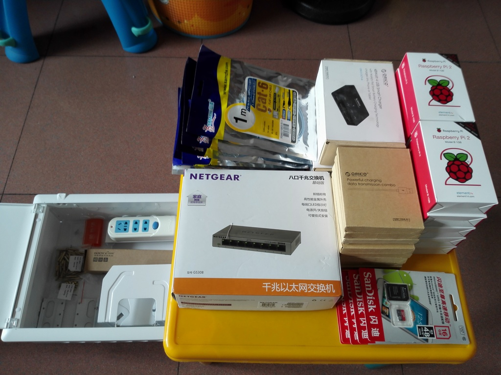
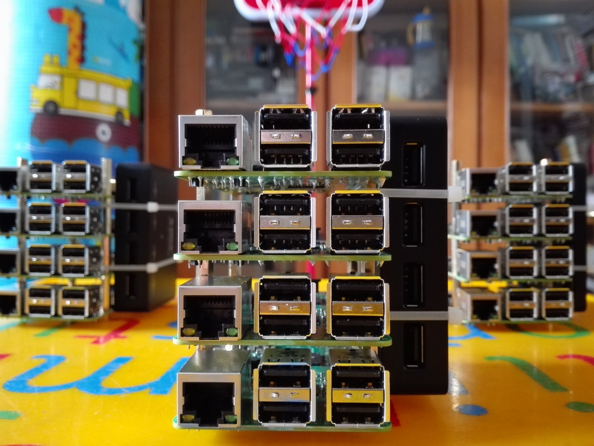
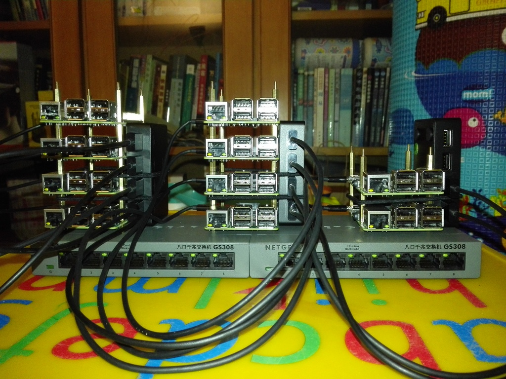
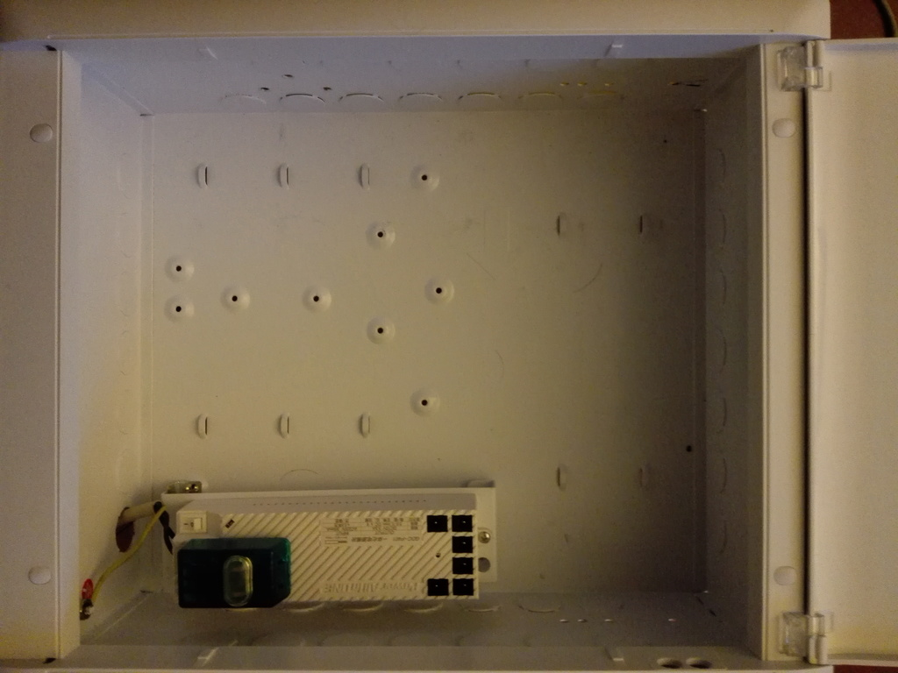
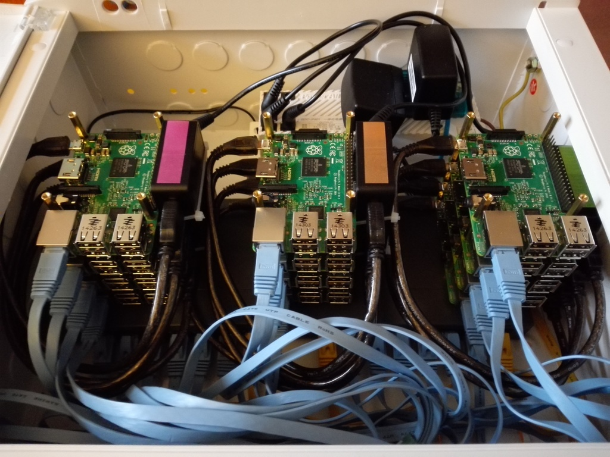
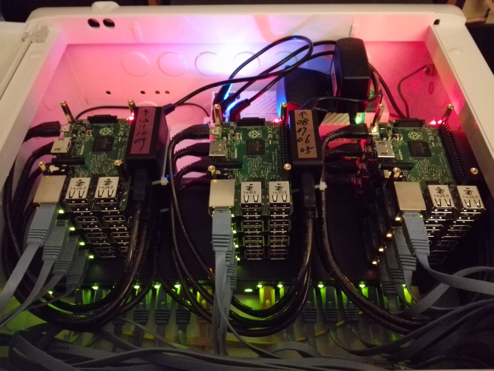
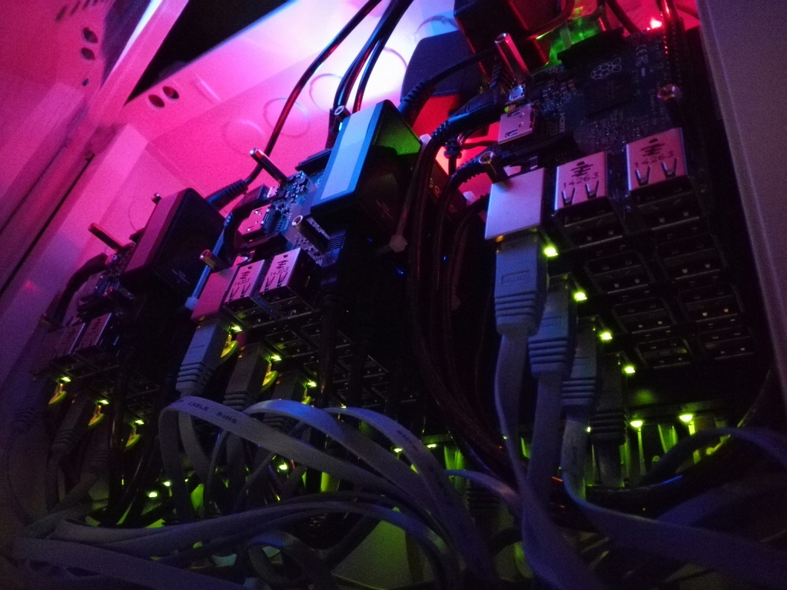

Raspberry Pi 2 B Cluster 
======================================

Component
------------------

+------------------------+--------------------------------------+-----------------+----------------+-----------------+-------+------------+-----------+--------------------------------------------------------------------+
| Item                   | Description                          | Dimensions (mm) | Unit Power (W) | Unit Price (￥) | Units | Price (￥) | Power (W) | Link                                                               |
+========================+======================================+=================+=======+========+=================+=======+============+===========+====================================================================+
| Raspberry Pi 2 Model B | 单板机 Single Board Computer         | 85 x 56 x 17    |   3.0 | MyCase |          258.00 |    10 |   2,580.00 |      36.0 | http://cn.element14.com/raspberry-pi-accessories?ICID=ap-rpi-2-hwb |
+------------------------+--------------------------------------+-----------------+-------+--------+-----------------+-------+------------+-----------+--------------------------------------------------------------------+
| NETGEAR GS308          | 8 口千兆交换机 1Gbps Network Switch  | 158 x 102 x 26  |   3.8 | Max    |          299.00 |     2 |     598.00 |       7.6 | http://item.jd.com/672092.html                                     |   
+------------------------+--------------------------------------+-----------------+-------+--------+-----------------+-------+------------+-----------+--------------------------------------------------------------------+
| ORICO DCP-4S-BK        | 4 口 USB 充电器 5V2.4Ax4 USB-charger | 96 x 57 x 21    |       |        |           79.00 |     3 |     237.00 |           | http://item.jd.com/1208500.html                                    |
+------------------------+--------------------------------------+-----------------+-------+--------+-----------------+-------+------------+-----------+--------------------------------------------------------------------+
| SAMZHE SZ-601BE        | CAT.6E 网线 Network Cable            | 1000            |       |        |            7.90 |    12 |      98.80 |           | http://item.jd.com/636308.html                                     | 
+------------------------+--------------------------------------+-----------------+-------+--------+-----------------+-------+------------+-----------+--------------------------------------------------------------------+
| SAMZHE BL-SZ03         | AM/Micro USB 数据线 USB-cable        | 300             |       |        |             5.9 |    12 |      70.80 |           | http://item.jd.com/922605.html                                     |
+------------------------+--------------------------------------+-----------------+-------+--------+-----------------+-------+------------+-----------+--------------------------------------------------------------------+
| SanDisk 16G Class 10   | Micro SD Card                        |                 |       |        |           42.90 |    10 |     429.00 |           | http://item.jd.com/679772.html                                     |
+------------------------+--------------------------------------+-----------------+-------+--------+-----------------+-------+------------+-----------+--------------------------------------------------------------------+
|                                                                                                                                                                                                                          | 
+------------------------+--------------------------------------+-----------------+-------+--------+-----------------+-------+------------+-----------+--------------------------------------------------------------------+
| e代家园 GRS11-35       | 配线箱 Case                          | 350 x 300 x 120 |       |        |          142.00 |     1 |     142.00 |           | http://detail.tmall.com/item.htm?id=40266420582                    |
+------------------------+--------------------------------------+-----------------+-------+--------+-----------------+-------+------------+-----------+--------------------------------------------------------------------+
| e代家园 GDC-P01        | 电源模块插座 Power Supply            | 165 x 49 x 36   |  40.0 | Output |           99.00 |     1 |      99.00 |      40.0 | http://detail.tmall.com/item.htm?id=42224837564                    |
+------------------------+--------------------------------------+-----------------+-------+--------+-----------------+-------+------------+-----------+--------------------------------------------------------------------+
| MIG SL-303CB           | 电源转换插座 Power Outlet            | 54 x 40 x 33    |       |        |           19.90 |     1 |      19.90 |           | http://item.jd.com/899125.html                                     |
+------------------------+--------------------------------------+-----------------+-------+--------+-----------------+-------+------------+-----------+--------------------------------------------------------------------+
| 单通铜螺柱 M2.5*20+6   |                                      |                 |       |        |            0.36 |    36 |      12.96 |           | http://detail.tmall.com/item.htm?id=26930900577                    |
+------------------------+--------------------------------------+-----------------+-------+--------+-----------------+-------+------------+-----------+--------------------------------------------------------------------+
| 单通铜螺柱 M2.5*5+5    |                                      |                 |       |        |            0.18 |    12 |       2.16 |           | http://detail.tmall.com/item.htm?id=26930900577                    |
+------------------------+--------------------------------------+-----------------+-------+--------+-----------------+-------+------------+-----------+--------------------------------------------------------------------+
| 双通铜螺柱 M2.5*20     |                                      |                 |       |        |            0.28 |    12 |       3.36 |           | http://detail.tmall.com/item.htm?id=19636777951                    |
+------------------------+--------------------------------------+-----------------+-------+--------+-----------------+-------+------------+-----------+--------------------------------------------------------------------+
| GT-140M                | 尼龙扎带（x1000）                    | 140 x 2.5       |       |        |          30.00  |     1 |      30.00 |           | http://detail.tmall.com/item.htm?id=36844630222                    |
+------------------------+--------------------------------------+-----------------+-------+--------+-----------------+-------+------------+-----------+--------------------------------------------------------------------+
|                        |                                      |                 |       |        |                 |       |   4,914.48 |           |                                                                    |
+------------------------+--------------------------------------+-----------------+-------+--------+-----------------+-------+------------+-----------+--------------------------------------------------------------------+

**Q**: Why 2 x 8-port 1Gbits network switches?

**A**: 12 Pis use 12 ports. 2 switches will be connected together, thus use one port for each.
We'll leave 2 ports for external working network. 12 + 1x2 + 2 = 16

**Q**: Why choose this 4 port USB power charger?

**A**: The dimentions are perfect for 4 Pis, and the power input connector is standand 5V2.4A 5.5*2.5mm, which is just suitable for GDC-P01 power supply.

**Q**: How to connect 4 Pis together?

**A**: At the bottom, use 4 x M2.5*5 + 5 bolts; And 4 x M2.5*20 + 5 between two Pis; At the top, use 4 x M2.5*20. The total heigh is 90mm, when it stands on network switch (26mm heigt), it's 116mm height, just suitable for the case's height(120mm).

**Q**: Is the width of this case enough for 3 groups Pis? 

**A**: Almost. Where you have to lower about 20mm the USB charger for the right group. Furtnately, when 2 network switches are placed one by one at the bottom, there is enough space left on the right side for the lowered USB charger.

**Q**: Is there still space for USB hard driver?

**A**: On the top-left side of the case, there is still space for about 4+ USB hard drivers, but you should choose the one that is about 110mm length, and put it vertically, Another choose is use 1.8" hard driver, just like me.

Intallation
----------------

Parts:

Bundled 4 x Raspberry Pis and 1 x USB Charger together as one group: height 90mm

The layout: 3 x groups stand on 2 x 8-port network switches 

The case with PSU installed

Finished:

Lighting: 

Lighting:

